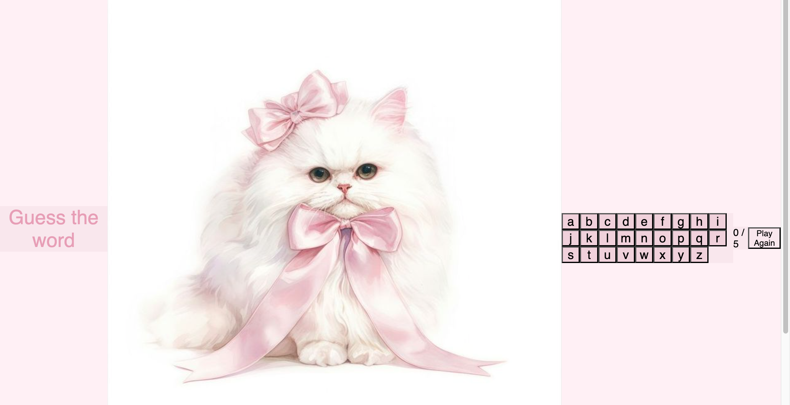
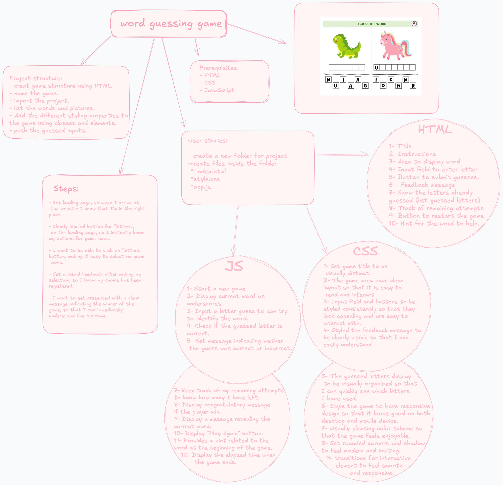

Project structure:
- creat game structure using HTML.
- name the game. 
- import the project. 
- list the words and pictures.
- Add the different styling properties to the game using classes and elements.
- push the guessed inputs.
